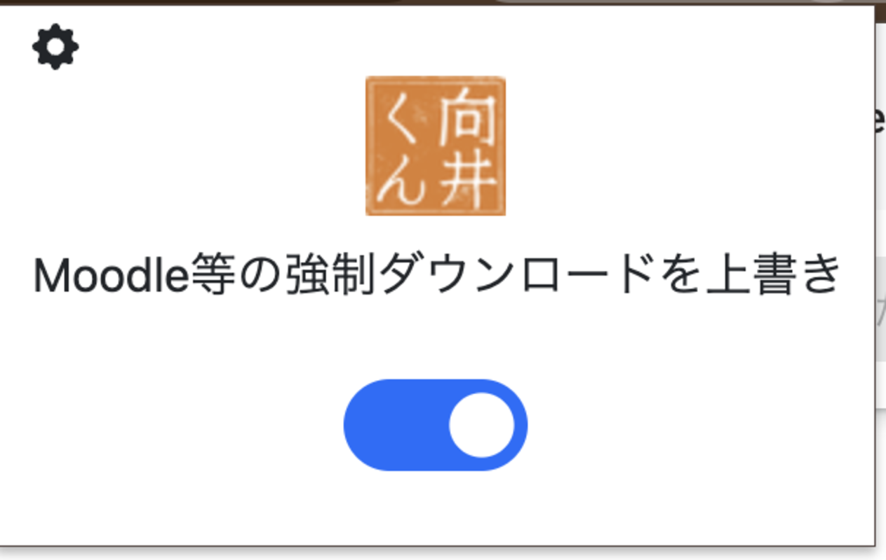
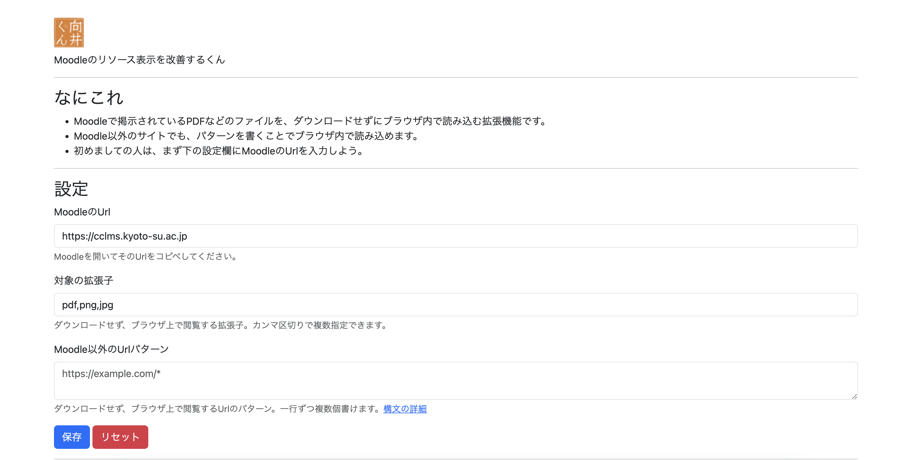

# mukaikun

    

    <h3>向井くん</h3>
    
Moodleのリソース表示を改善するくん

## これは何
- Moodleで掲示されているPDFなどのファイルを、ダウンロードせずにブラウザ内で読み込むChrome拡張機能です。
- Moodle以外のサイトでも、パターンを書くことでブラウザ内で読み込めます。
- 初めましての人は、まず下の設定欄にMoodleのUrlを入力しよう。

## サポート
- 使用方法についてのお問い合わせは、[@taiseiue : X](https://x.com/taiseiue)にどうぞ。
- 不具合の報告や新機能の提案は、[Issues](https://github.com/taiseiue/mukaikun/issues)にお願いします。

## ライセンス・免責
- 向井くんは、[MITライセンス](./LICENSE)で公開しています。
- 使用中に起こったいかなる不具合、不利益について、作者は責任を負えません。

## スクリーンショット

**ポップアップ**

**設定画面**

